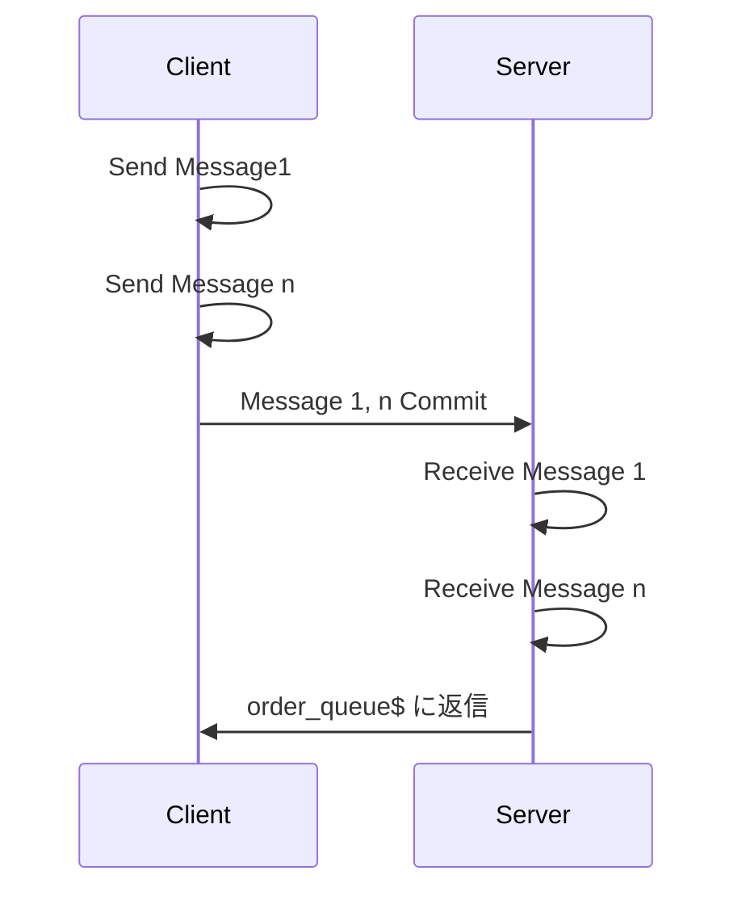

そろそろ仕事をちゃんとしていることを書かないとならんかと思うので MSMQ。今年を振り返る「なんかかく」アドベントカレンダー 5 日目です。技術記事はバズるかバズらないかみたいな話を読みましたがこの記事はバズらない方の記事なので安心してお読みください。

そのうちもっと真面目にまとめたいのですが、ひとまずは個人のチラシの裏として。2024 年、今年は「MSMQ」をかなり「[完全に理解した](https://zenn.dev/e99h2121/articles/c11daf42169beb)」ところから、何もわからない に至ったのでまとめてみます。

## MSMQ 

[Microsoft Message Queuing - Wikipedia](https://en.wikipedia.org/wiki/Microsoft_Message_Queuing)

メッセージ キューイング サービス です。Azure だと以下らへんです。

[Azure メッセージング サービスの比較 - Azure Service Bus | Microsoft Learn](https://learn.microsoft.com/ja-jp/azure/service-bus-messaging/compare-messaging-services)
[Azure でのメッセージング サービス | Microsoft Azure](https://azure.microsoft.com/ja-jp/solutions/messaging-services)
[Azure メッセージング サービスのドキュメント | Microsoft Learn](https://learn.microsoft.com/ja-jp/azure/messaging-services/)

  
Queue って Que なのか Queue なのか Q なのか迷いますが Queuing って一番そこじゃないだろ！ってとこで ing 付きますよね。身近なところでこれ ↓ をイメージします。

(404 を引き当てた)

これ的な業務を企業内とか、企業間とかで構築して各種用途で使うことをイメージします。まあクラウド的なものができるより何年も前から稼働しているものが多いんだろうと思います。前職の [バッチ処理の裏(側) の話](https://qiita.com/e99h2121/items/d9a83a6e47a53dcfbfbd) と同じやて。

## メッセージ キュー

[メッセージキュー - Wikipedia](https://ja.wikipedia.org/wiki/%E3%83%A1%E3%83%83%E3%82%BB%E3%83%BC%E3%82%B8%E3%82%AD%E3%83%A5%E3%83%BC)
[Message Queuing (MSMQ) | Microsoft Learn](https://learn.microsoft.com/ja-jp/previous-versions/windows/desktop/msmq/ms711472(v=vs.85))

> Purpose
Message Queuing (MSMQ) technology enables applications running at different times to communicate across heterogeneous networks and systems that may be temporarily offline. Applications send messages to queues and read messages from queues. The following illustration shows how a queue can hold messages that are generated by multiple sending applications and read by multiple receiving applications.

> メッセージ キュー (MSMQ) で、非同期アプリケーションが、一時的にオフラインになる可能性のある異種ネットワークやシステム間でも通信できます。アプリケーションは、キューにメッセージを送信し、キューからメッセージを読み取ります。図は、複数の送信アプリケーションによって生成され、複数の受信アプリケーションによって読み取られるメッセージをキューに保持する方法を示しています。

同じページから 図 引用。

## 記事

チョット書いたもの。
  
- [MSMQ を有効化する手順・メッセージを送受信する手順 | Japan Azure Integration Support Blog](https://jpazinteg.github.io/blog/MSMQ/MsmqCheckInstall/)
- [MSMQ で End2End ログを取得する手順 | Japan Azure Integration Support Blog](https://jpazinteg.github.io/blog/MSMQ/MsmqEnd2Endlog/)
- [MSMQ のトランザクション メッセージ | Japan Azure Integration Support Blog](https://jpazinteg.github.io/blog/MSMQ/MsmqTransaction/)

## シーケンス図

動作検証に基づいて大体こう。

## 使い方

[MSMQ を有効化する手順・メッセージを送受信する手順 | Japan Azure Integration Support Blog](https://jpazinteg.github.io/blog/MSMQ/MsmqCheckInstall/) にもあるのですが、Windows をご利用ならば今すぐ使えます。

これであなたの PC も非同期処理の仲間だ！

## 読み物

何かよくわからんけどちゃんと読みたい小話: (実際には意外とまだ生きてる)

https://particular.net/blog/msmq-is-dead

> <機械翻訳>
> 2007年、NServiceBusの最初のバージョンはMSMQのラッパーだった。その後、他のメッセージ・トランスポートのサポートが追加されました。MSMQは私たちの歴史の重要な一部であり、その消滅には複雑な思いがあります。

> というのも、MSMQの将来は1年ほど不透明だったからです。お客様からMSMQは死んだのかと聞かれ、私たちは正直に「わからない」と答えていました。少しつらいかもしれませんが、少なくともマイクロソフトの発表によって、この疑問が確信に変わり、最終的な結論を得ることができました。

> 別れることは難しいが、現実的な目的から言えば、MSMQはなくなり、前に進む時が来たのだ。MSMQよ、安らかに眠れ。さようなら。

[What is Microsoft Message Queuing (MSMQ)? How does it work? - Stack Overflow](https://stackoverflow.com/questions/400115/what-is-microsoft-message-queuing-msmq-how-does-it-work)

などなど。

今日は以上です～
