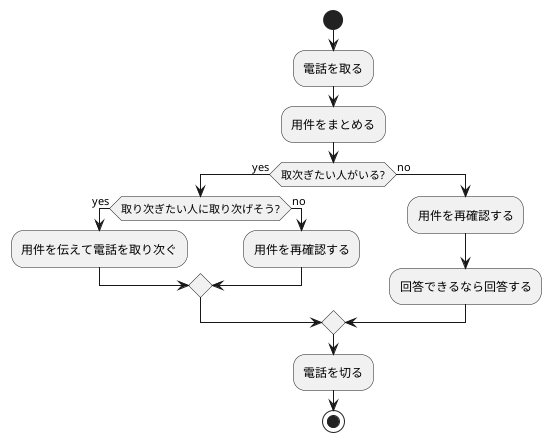
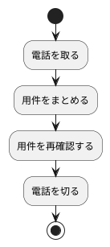

## Long, long ago.

在宅勤務が主になった今ですが、かつて新人は電話をとるものだという時代がありました。
社内Wikiにそんな過去の遺産となったページを見つけました。
問題のなさそうな範囲での抜粋です。

```md
# 電話に出たときの対応

## 第一声

「はい。(部署名) の (自分の名前) が取りました。」
※「(部署名)」のところは、「(一番小さなチーム名)」でも「開発」でも「(担当サブシステム名)」でも、なんでも良い。

## 電話相手の情報

* 電話相手の所属
* 電話相手の名前
* 宛先（誰に電話を取り次ぐのか）

をまずメモる。
電話を取り次ぐだけなら、これを聞いて、電話を渡して、おしまい。

## 取次先が取込中のとき

例えば

* 電話会議中のとき（マイク付きヘッドセットをしている）
* 偉い人や同僚と仕事のことについて話し込んでいるとき

そんなときは一度、電話相手に

`「現在とりこんでいるようなのですが、後ほど、こちらから折り返しても大丈夫でしょうか。」`

など言って、相手の緊急度を尋ねてみる。緊急度が高そうであれば、電話を渡しに行く。

## 宛先がない場合（電話相手が「とにかく問い合わせを見てほしい」とき）

OR

## 取り次ぐ人がいない場合（お昼ご飯に行ってるとか）

### 相手の話のメモを取る

### 時間がないとき

* 問い合わせ起票URL
* 回答の期日

だけ聞いておけば、最低限なんとかなる。

### 可能な限り

・お客様名
・問い合わせの内容
 　【問題】
 　【現状】
 　【期待されている対応内容】
・指定された期日

を聞く。

(以下略)

```

なんとも文字通り涙ぐましいです

> ※「(部署名)」のところは、「(一番小さなチーム名)」でも「開発」でも「(担当サブシステム名)」でも、なんでも良い。

あたりにそれが滲み出ていますが、まあ電話をとるって緊張しますよね。

- 聞きたい（問い合わせたい）内容がまとまっていない場合、電話相手に「まとめてください」ということを頼む。
- 先輩が戻ったら電話があったことを伝え、メモの内容を伝える。
- 自分で見てわからなさそうだったら、チームのSlackに問い合わせの内容をできるだけ詳細に伝えて、協力を依頼する。

などという細やかなTipsが続くのですが、これら私がいま新人だったらツライ業務の一つだなと思います。

## 一方

このフォーマットが面白いフローチャートだったので噛み砕いて考えてみました。



電話を受けた際のゴールは、つまりは、緊急度と重要度をうまくヒアリングして、相手の状況を過不足無くサマリする。それに尽きます。内容はIssueやチケットの書き方と同じですよね。

[伝わるチケットの書き方（チームメンバーが理解できる！作業できる！） - Qiita](https://qiita.com/aut44takada/items/12f62b9295c28f408e93#%E3%83%81%E3%82%B1%E3%83%83%E3%83%88%E3%81%AE%E5%85%B7%E4%BD%93%E7%9A%84%E3%81%AA%E6%9B%B8%E3%81%8D%E6%96%B9)
＊Issueの書き方をまた後日書きたいと思います。
つまり理想形は以下なのです。





## Now.

PlantUMLで書いてみたいだけのようになってしまいましたが、

、在宅勤務が主になった今、新人が電話をとるものだという時代は過去のものになりました。しかしポイントはおそらく変わりません。「緊急度と重要度をうまくヒアリングして、状況を過不足無くサマリ」し、開発としてどうアクションするかの現況に落とし込む作業です。

社内の開発内応対Slackチャンネルでも意識できるよう工夫を考えていきたいポイントです。
以上です～。
